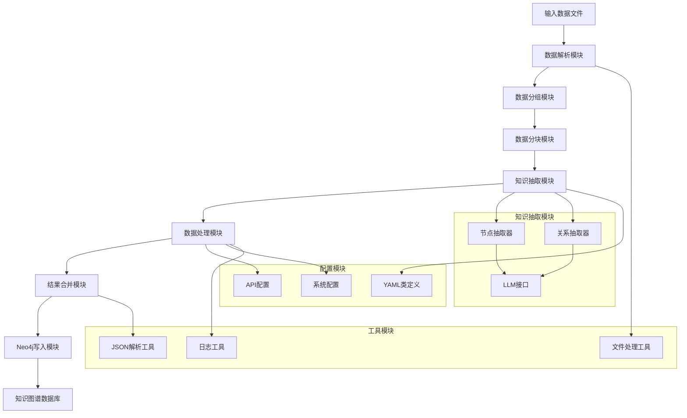
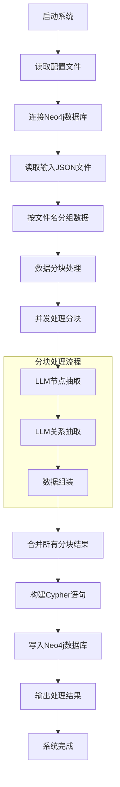
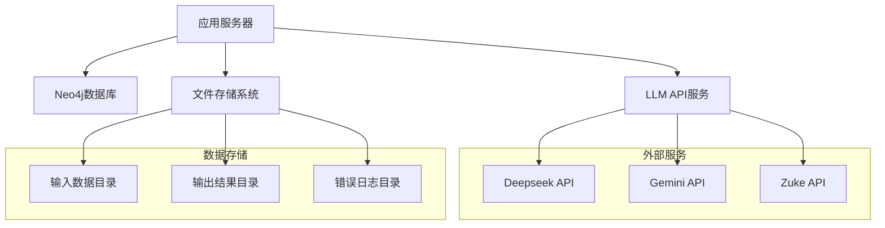

## 运行

```shell
cd C:\0_Dev\kotlin\kg-kotlin\build\libs
CHCP 65001
java -jar kg-kotlin.jar
pause
```

# 知识图谱抽取系统设计文档

## 1. 功能模块设计



## 2. 系统架构流程设计



## 3. 数据模型设计（ER图）

### 3.1 核心实体表

| 实体名称 | 属性 | 类型 | 说明 |
|---------|-----|------|-----|
| **ExtractedData** | nodes | Map<String, YamlClass> | 节点数据映射 |
| | edges | List<String> | 边数据列表 |
| | relations | List<List<String>> | 关系数据列表 |

### 3.2 节点相关表

| 实体名称 | 属性 | 类型 | 说明 |
|---------|-----|------|-----|
| **NodeJsonData** | entities | List<Node> | 实体节点列表 |
| **Node** | name | String | 节点名称 |
| | yamlClass | YamlClass | 节点类型定义 |
| **YamlClass** | className | String | 类名称 |
| | params | List<String> | 类参数列表 |

### 3.3 关系相关表

| 实体名称 | 属性 | 类型 | 说明 |
|---------|-----|------|-----|
| **RelationJsonData** | relations | List<List<String>> | 三元关系组列表 |
| **Relation** | subject | String | 关系主体 |
| | predicate | String | 关系谓词 |
| | object | String | 关系客体 |

### 3.4 配置相关表

| 实体名称 | 属性 | 类型 | 说明 |
|---------|-----|------|-----|
| **Api** | baseUrl | String | API基础URL |
| | modelName | String | 模型名称 |
| | apiKeys | List<String> | API密钥列表 |
| **GroupedItems** | filename | String | 文件名 |
| | items | List<Item> | 数据项列表 |

## 4. 接口设计

### 4.1 核心接口定义

- **IDataProcessor**: 数据处理接口，负责节点和关系抽取
- **IDataWriter**: 数据写入接口，负责Neo4j数据写入
- **ICleanDataParser**: 数据解析接口，负责JSON数据解析
- **IDataChucking**: 数据分块接口，负责数据分块处理
- **IYamlParser**: YAML解析接口，负责类定义解析

### 4.2 LLM集成接口

- **BaseLLMJsonExtractor**: LLM抽取基类
- **NodeExtractor**: 节点抽取器
- **RelationsExtractor**: 关系抽取器

## 5. 部署架构设计

### 5.1 系统环境要求

- **Java运行环境**: JDK 17或更高版本
- **Neo4j数据库**: 版本5.x系列
- **系统内存**: 建议4GB以上
- **磁盘空间**: 至少1GB可用空间

### 5.2 部署组件

- **应用程序**: kg-kotlin.jar（约50MB）
- **配置文件**: 
  - application.yml（系统配置）
  - example.yaml（类定义模板）
- **数据目录**:
  - input/（输入数据目录）
  - output/（输出结果目录）
  - error/（错误日志目录）

### 5.3 部署步骤

- 安装Java 17运行环境
- 部署Neo4j数据库服务
- 配置数据库连接参数
- 部署应用程序jar包
- 配置输入输出目录
- 配置LLM API密钥
- 启动应用程序

### 5.4 网络架构



## 6. 关键技术特性

### 6.1 并发处理能力

- 基于Kotlin协程的异步处理
- 支持多API密钥并发调用
- 智能限流控制防止API超限

### 6.2 数据处理优化

- 智能数据分块算法
- 重叠内容处理机制
- 错误数据自动隔离

### 6.3 可扩展性设计

- 面向接口编程架构
- 插件化的LLM接口设计
- 可配置的数据处理流程

### 6.4 容错机制

- 异常处理与日志记录
- 自动重试机制
- 数据完整性校验

## 7. 待实现功能

### 7.1 Cypher语句生成模块

- 节点创建语句生成
- 关系创建语句生成
- 批量操作优化
- 事务管理机制

### 7.2 Neo4j集成完善

- 连接池管理
- 数据写入优化
- 索引创建策略
- 数据验证机制

---

*注：本系统采用Java技术栈开发，基于现代化的微服务架构设计，具备良好的可扩展性和维护性。*
